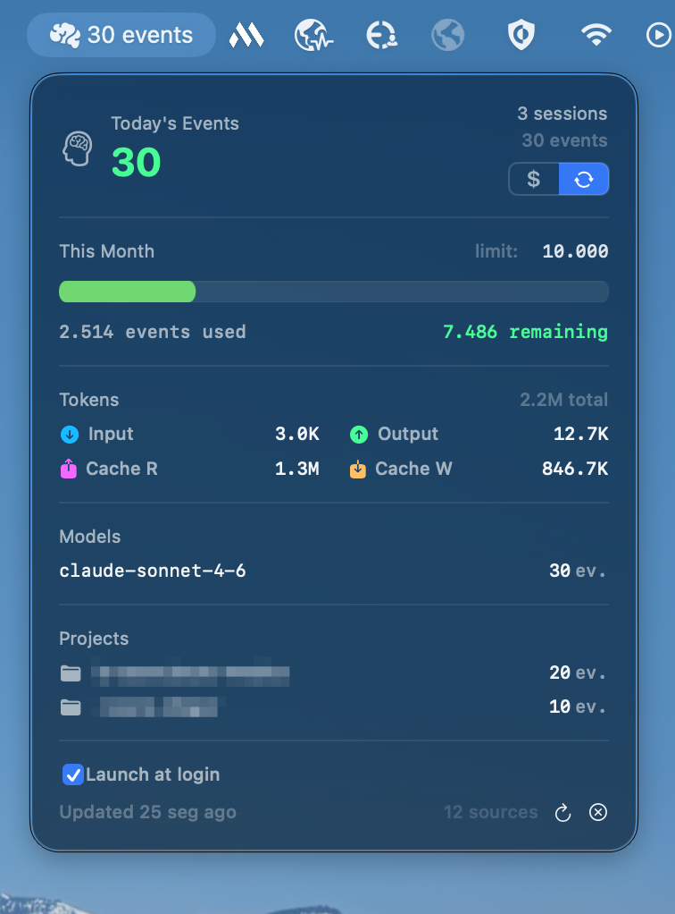

# Kill the Bill

Track Claude Code and Codex token usage and cost from your macOS menu bar.



## Install

```bash
/bin/bash -c "$(curl -fsSL https://raw.githubusercontent.com/sozua-ciandt/kill-the-bill/main/install.sh)"
```

The installer downloads the latest ad-hoc-signed app from GitHub Releases,
verifies its bundle identity and code signature, and installs
`KillTheBill.app` into `/Applications`. If administrator permission is not
available on a fresh install, it installs into `~/Applications` instead.

Releases aren't notarized (this project has no Apple Developer account), so
macOS may show an "unidentified developer" warning if you download the
`.app.zip` manually instead of using the installer above; installing via the
script avoids this since `curl` doesn't apply the quarantine flag a browser
download would.

Requires macOS 14+. Xcode Command Line Tools are no longer required to install
the app.

The installer preserves an existing install location so Launch at Login keeps a
stable path. After the new bundle passes validation, it removes a verified old
copy from the other standard location, preventing both `/Applications` and
`~/Applications` copies from starting together.

## Automatic updates

Kill the Bill checks the repository's latest stable GitHub Release on a daily
schedule when automatic checks are enabled. It never downloads or installs an
update without an explicit user action, and it ignores draft and pre-release
builds.

Updates can replace the current bundle in place when its directory is writable;
the app stages and validates the new bundle first and rolls back if replacement
or relaunch fails. macOS doesn't provide a safe password prompt for a standalone
app without a separately signed privileged helper, so an app installed in a
non-writable `/Applications` directory stops at “ready” and asks you to run the
official installer above. The installer is the authorized path for that case.

Versions up to 0.4.2 don't contain the updater. Run the installer once to
bootstrap onto a release with the updater; subsequent versions can check for
updates from inside the app.

## Reinstall or update

Run the install command again. It transactionally replaces the existing app
with the latest validated release and restores the previous bundle on failure.

## Uninstall

```bash
/bin/bash -c "$(curl -fsSL https://raw.githubusercontent.com/sozua-ciandt/kill-the-bill/main/uninstall.sh)"
```

## Contributing

Development setup and architecture notes are in
[CONTRIBUTING.md](CONTRIBUTING.md).
